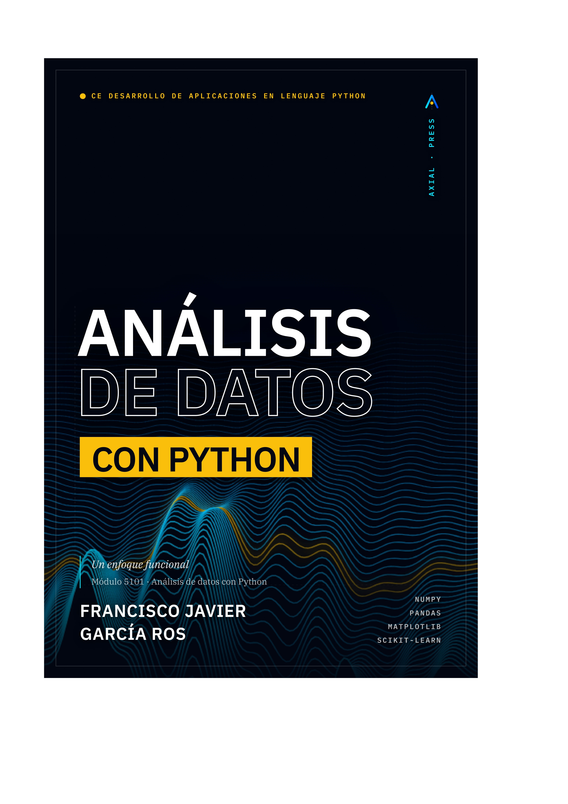

# Análisis de Datos con Python

<p align="center">
  
</p>

Bienvenido al repositorio oficial del libro **"Análisis de Datos con Python"**. Este repositorio contiene todos los materiales necesarios para seguir el curso: datasets, notebooks de Jupyter con el código de los capítulos y soluciones a los ejercicios prácticos.

## 📂 Estructura del Repositorio

- **`data/raw/`**: Datasets originales tal cual se descargan de la fuente (para practicar limpieza).
- **`notebooks/`**: Cuadernos de Jupyter organizados por Unidad Temática (UT).
- **`docs/`**: Documentación adicional (Diccionario de datos, guías de instalación).

## 🚀 Cómo Empezar

### Opción A: Google Colab (Recomendada para principiantes)
Puedes ejecutar los notebooks directamente en la nube sin instalar nada:

| Unidad | Notebook | Abrir en Colab |
| :--- | :--- | :--- |
| UT1 — El Detective de Datos | `UT01_El_Detective_de_Datos.ipynb` | [](https://colab.research.google.com/github/jgarcia314/analisis-datos-python-fp/blob/main/notebooks/UT01_El_Detective_de_Datos.ipynb) |
| UT2 — NumPy: Computación Vectorizada | `UT02_NumPy_Computacion_Vectorizada.ipynb` | [](https://colab.research.google.com/github/jgarcia314/analisis-datos-python-fp/blob/main/notebooks/UT02_NumPy_Computacion_Vectorizada.ipynb) |
| UT3 — Pandas: Manipulación de DataFrames | `UT03_Pandas_Manipulacion_DataFrames.ipynb` | [](https://colab.research.google.com/github/jgarcia314/analisis-datos-python-fp/blob/main/notebooks/UT03_Pandas_Manipulacion_DataFrames.ipynb) |
| UT4 — Adquisición de Datos | `UT04_Adquisicion_de_Datos.ipynb` | [](https://colab.research.google.com/github/jgarcia314/analisis-datos-python-fp/blob/main/notebooks/UT04_Adquisicion_de_Datos.ipynb) |
| UT5 — Preprocesamiento Avanzado | `UT05_Preprocesamiento_Avanzado.ipynb` | [](https://colab.research.google.com/github/jgarcia314/analisis-datos-python-fp/blob/main/notebooks/UT05_Preprocesamiento_Avanzado.ipynb) |
| UT6 — EDA: Estadística Descriptiva | `UT06_EDA_Estadistica_Descriptiva.ipynb` | [](https://colab.research.google.com/github/jgarcia314/analisis-datos-python-fp/blob/main/notebooks/UT06_EDA_Estadistica_Descriptiva.ipynb) |
| UT7 — Visualización de Datos | `UT07_Visualizacion_de_Datos.ipynb` | [](https://colab.research.google.com/github/jgarcia314/analisis-datos-python-fp/blob/main/notebooks/UT07_Visualizacion_de_Datos.ipynb) |
| UT8 — Machine Learning Básico | `UT08_Machine_Learning_Basico.ipynb` | [](https://colab.research.google.com/github/jgarcia314/analisis-datos-python-fp/blob/main/notebooks/UT08_Machine_Learning_Basico.ipynb) |
| UT9 — Dashboards y Comunicación | `UT09_Dashboards_Comunicacion.ipynb` | [](https://colab.research.google.com/github/jgarcia314/analisis-datos-python-fp/blob/main/notebooks/UT09_Dashboards_Comunicacion.ipynb) |
| UT10 — Proyecto Final Integrador | `UT10_Proyecto_Final_Integrador.ipynb` | [](https://colab.research.google.com/github/jgarcia314/analisis-datos-python-fp/blob/main/notebooks/UT10_Proyecto_Final_Integrador.ipynb) |

### Opción B: Entorno Local (Recomendada para profesionales)
1. Clona este repositorio:
   ```bash
   git clone https://github.com/jgarcia314/analisis-datos-python-fp.git
   cd analisis-datos-python-fp
   ```
2. Crea un entorno virtual e instala las dependencias exactas:
   ```bash
   pip install -r requirements.txt
   ```

## 📊 Datasets Incluidos

| Dataset | Descripción | Uso en UTs |
| :--- | :--- | :--- |
| `house_prices.csv` | Precios de viviendas en Ames, Iowa — 1.460 registros, 81 variables (Regresión) | UT6, UT7, UT9, UT10 |
| `titanic.csv` | Pasajeros del Titanic — supervivencia y perfil socioeconómico (Clasificación) | UT1, UT3, UT4, UT8, UT9 |
| `iris.csv` | Medidas de pétalos y sépalos de 3 especies de iris (Clasificación) | UT2, UT4, UT6, UT7, UT8, UT9 |
| `used_cars_raw.csv` | Vehículos de segunda mano de CarDekho — 301 registros (Regresión) | UT5 |
| `air_quality_uci.csv` | Calidad del aire con series temporales horarias (UCI) | UT2 |
| `emp_attrition.csv` | Rotación de empleados — variables laborales y satisfacción | UT6 |
| `telco_churn.csv` | Abandono de clientes en empresa de telecomunicaciones | UT6 |
| `california_housing.csv` | Precios de viviendas en California — variables geográficas | UT8 |
| `winequality-red.csv` | Calidad de vinos tintos — propiedades fisicoquímicas | UT8 |
| `cars.csv` | Dataset auxiliar de referencia | — |

*Consulta `docs/Diccionario_Datos.md` para el detalle de las variables de House Prices.*

## ⚖️ Licencia

El código de este repositorio se distribuye bajo licencia **MIT**. Los textos y explicaciones pertenecen al libro y están protegidos por derechos de autor.
